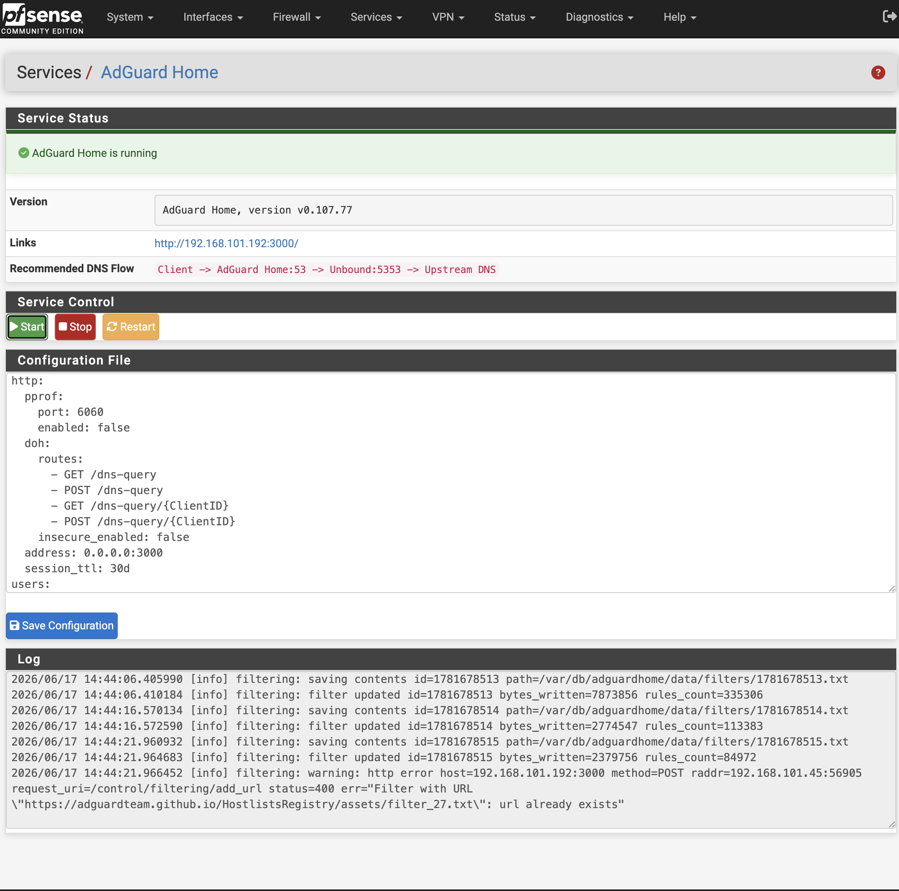

<p align="center">
  
</p>
<h1 align="center">AdGuard Home for pfSense</h1>
<div align="center">
  中文 | <a href="README.en.md">English</a><br><br>
</div>
<p align="center">
  
  
  
</p>

AdGuard Home 是一个基于 DNS 的全网广告拦截和隐私保护解决方案，可为家庭和企业网络中的所有设备提供统一的 DNS 过滤服务。所有客户端（如手机、电脑、智能电视和 IoT 设备）的域名请求都会先经过 AdGuard Home，由其负责拦截广告、跟踪器、恶意域名，并提供安全、可控的 DNS 解析能力。

本项目是专为 pfSense 防火墙打造的集成项目，提供 AdGuard Home 的一键部署与管理能力。项目包含服务管理脚本、Web UI 菜单入口、CGI 管理页面以及持久化配置目录，实现与 pfSense 系统的深度集成，让用户能够像管理原生组件一样安装、配置和维护 AdGuard Home。

已在以下环境测试通过：

- pfSense CE 2.8.1
- pfSense Plus 26.03



## 推荐设置

pfSense 默认由 Unbound DNS Resolver 监听 `53` 端口。如果希望通过 AdGuard Home 对局域网客户端生效，推荐DNS设置为：

```text
客户端 -> AdGuard Home:53 -> Unbound DNS Resolver:5353 -> 上游 DNS
```
可以实现：

- 局域网客户端继续使用 pfSense 的 `53` 端口作为 DNS。
- AdGuard Home 监听 `0.0.0.0:53`，负责广告过滤、查询日志和统计。
- Unbound 改为监听 `127.0.0.1:5353`，继续使用 pfSense 原有 DNS Resolver 功能。
- AdGuard Home 的上游 DNS 设置为 `127.0.0.1:5353`。

插件安装不会自动修改 Unbound 端口，避免破坏现有 DNS 配置。请在确认 AdGuard Home 初始化正常后手动切换。

## 编译构建

需要在 FreeBSD 或 pfSense 主机上构建：

```sh
sh build.sh
```
默认会生成：

```text
dist/pfSense-pkg-adguardhome.pkg
```
构建脚本会优先使用：

```text
src/usr/local/bin/AdGuardHome_freebsd_amd64.tar.gz
```
如果本地资产不存在，会从 AdGuard 官方 Release 下载：

```text
https://static.adguard.com/adguardhome/release/AdGuardHome_freebsd_amd64.tar.gz
```
## 安装命令

```sh
pkg add -f dist/pfSense-pkg-adguardhome.pkg
```
首次启动后打开：

```text
http://<pfsense-host>:3000/
```
如果 Unbound 仍在占用 `53` 端口，首次初始化 AdGuard Home 时可以先把 DNS 监听端口设置为 `5353` 或其他空闲端口，待初始化完成后再切换正式链路。

## 接管端口

先停止 AdGuard Home，在 pfSense Web UI 中进入：

```text
服务 > DNS 解析 > 常规设置
```
将 DNS Resolver 的监听端口从 `53` 修改为 `5353`，并保存应用。建议让 Unbound 只服务本机上游链路，至少确保 `127.0.0.1:5353` 可用。

然后在 AdGuard Home Web UI 中设置：

```yaml
dns:
  bind_hosts:
    - 0.0.0.0
  port: 53
  upstream_dns:
    - 127.0.0.1:5353
```
然后重启服务。

## 检查验证

查看端口监听：

```sh
sockstat -4 -l | egrep ':(53|5353|3000)'
```
期望结果：

- `AdGuardHome` 监听 `*:53`
- `unbound` 监听 `127.0.0.1:5353`
- AdGuard Home Web UI 监听 `*:3000`

测试 DNS：

```sh
dig @127.0.0.1 -p 53 bing.com
dig @127.0.0.1 -p 5353 bing.com
```
## 回滚设置

如果需要恢复 pfSense 默认 DNS 行为，先停止 adguardhome服务。然后在 pfSense Web UI 中把 DNS Resolver 端口改回 `53` 并应用，最后重启 Unbound。

## 卸载命令

```sh
pkg delete -y pfSense-pkg-adguardhome
```

## 免责声明
这是一个非官方社区项目，与 pfSense 团队没有任何关联，也未获得其认可或支持。 部署前请自行审查源代码，并自行承担使用过程中可能产生的风险。
