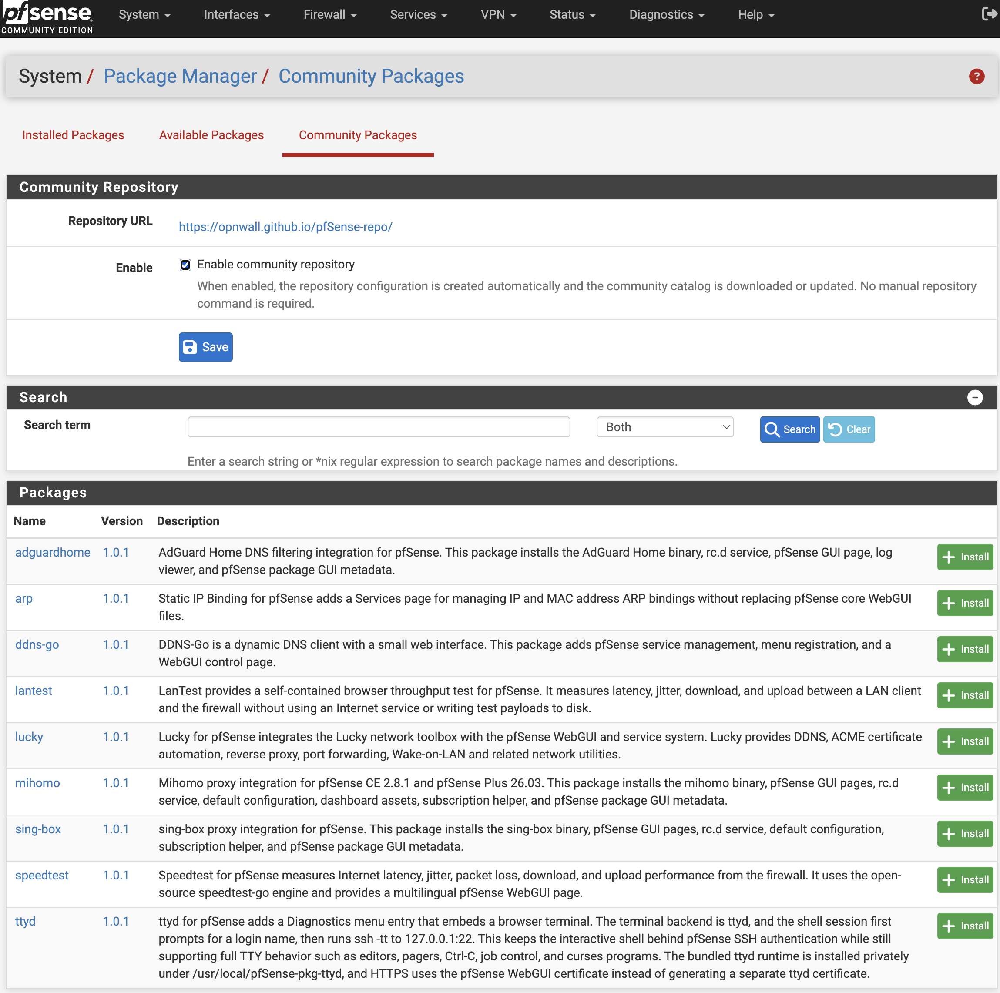

# Community Repository for pfSense

`pfSense-pkg-community-repo` integrates the Opnwall community package
repository with the native pfSense Package Manager.

## Features

- Adds a **Community Packages** tab beside **Installed Packages** and
  **Available Packages**.
- Shows only packages published by the Opnwall repository on the community
  tab and hides them from the normal available-package list.
- Provides a WebGUI switch that creates, enables, disables, and refreshes the
  repository without manual `pkg` commands.
- Automatically selects the correct repository for pfSense CE or pfSense Plus.
- Supports English, Simplified Chinese, and Traditional Chinese. Other
  languages fall back to English.
- Reapplies its small, marked WebGUI integration at boot so it survives
  pfSense upgrades.
- Keeps the repository configuration during removal so pfSense package
  reinstallation can find the package after a firmware upgrade.



## Supported systems

| System | Tested version | ABI |
| --- | --- | --- |
| pfSense CE | 2.8.1 | `FreeBSD:15:amd64` |
| pfSense Plus | 26.03.1 | `FreeBSD:16:amd64` |

The package itself uses the portable `FreeBSD:*:amd64` ABI.

## Installation

Bootstrap the appropriate Opnwall repository once, then install the plugin.

### pfSense CE

```sh
fetch -o /usr/local/etc/pkg/repos/opnwall.conf \
  https://opnwall.github.io/pfSense-repo/pfsense-ce-opnwall.conf
pkg update -f -r opnwall
pkg install pfSense-pkg-community-repo
```

### pfSense Plus

```sh
fetch -o /usr/local/etc/pkg/repos/opnwall.conf \
  https://opnwall.github.io/pfSense-repo/pfsense-plus-opnwall.conf
pkg update -f -r opnwall
pkg install pfSense-pkg-community-repo
```

After installation, open **System > Package Manager > Community Packages**.
Further repository enable/disable and catalog refresh operations are available
from that page.

## Build

Build on a FreeBSD or pfSense amd64 host:

```sh
./build.sh
pkg add -f dist/pfSense-pkg-community-repo.pkg
```

The default build produces a universal amd64 package. Use
`TARGET_ABI=native ./build.sh` when a native ABI package is required.

## Files

- `/usr/local/www/pkg_mgr_community.php`: community package list and settings.
- `/usr/local/sbin/community-repo-ui`: idempotent WebGUI patch manager.
- `/usr/local/etc/rc.d/community_repo_ui`: boot-time integration check.
- `/usr/local/etc/pkg/repos/opnwall.conf`: repository configuration.

## Uninstallation

```sh
pkg delete pfSense-pkg-community-repo
```

Uninstallation removes the WebGUI page and marked integration blocks. It
intentionally keeps `opnwall.conf`; remove that file manually only when the
Opnwall repository is no longer needed.

