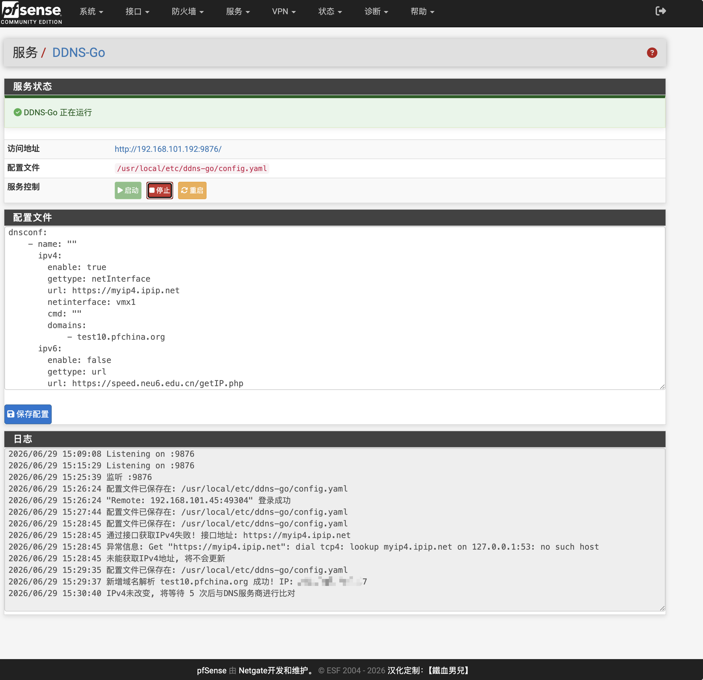

<p align="center">

  

</p>


# DDNS-Go for pfSense


DDNS-GO 是一款开源、轻量级的动态域名解析工具，可自动将公网 IPv4/IPv6 地址同步到多个 DNS 服务商，实现动态 IP 的域名自动更新。

这是一个用于 pfSense 的 DDNS-Go 集成包，提供 WebGUI 菜单、服务管理、开机自启和标准 `pkg` 打包支持。

已在以下环境测试通过：
- pfSense CE 2.8.1
- pfSense Plus 26.03



## 结构

- `src/` 按 pfSense 实际安装路径组织文件。
- `src/usr/local/bin/ddns-go` 是本地内置的 FreeBSD amd64 二进制文件。
- `src/usr/local/etc/rc.d/ddnsgo` 使用 `daemon(8)` 管理 DDNS-Go 服务。
- `src/usr/local/etc/rc.d/ddnsgo.sh` 用于兼容 pfSense `localpkg` 开机启动扫描。
- `src/usr/local/pkg/ddnsgo.xml` 注册 pfSense 菜单和服务元数据。
- `src/usr/local/www/services_ddnsgo.php` 提供 pfSense WebGUI 管理页面。
- `packaging/freebsd/` 保存 FreeBSD/pkg 打包元数据和安装、卸载 hook。

## 编译

请在 FreeBSD 或 pfSense 主机上编译：

```sh
./build.sh
```

默认生成通用 amd64 ABI 包：`FreeBSD:*:amd64`，可用于 pfSense CE 和 pfSense Plus 的 amd64 系统。

编译时会优先使用本地二进制：

- 如果 `src/usr/local/bin/ddns-go` 存在，则直接打包该本地文件。
- 如果本地文件不存在，`build.sh` 会从 GitHub 获取 DDNS-Go 最新版本，并下载 FreeBSD x86_64 版本后打包。

## 安装

```sh
pkg add pfSense-pkg-ddns-go.pkg
```

安装完成后，刷新 pfSense WebGUI，进入 `服务 > DDNS-Go`。

默认配置：

- Web 端口：`9876`
- 配置文件：`/usr/local/etc/ddns-go/config.yaml`
- 首次安装默认账号：`admin`
- 首次安装默认密码：`admin`

## 卸载

```sh
pkg delete pfSense-pkg-ddns-go
```

卸载时会停止服务，并清理以下文件：

- `/etc/rc.conf.d/ddnsgo`
- `/var/run/ddnsgo.pid`
- `/var/log/ddnsgo.log`
- `/usr/local/etc/ddns-go`
- `/usr/local/share/pfSense/menu/pfSense-Services_ddnsgo.xml`

## 免责

这是一个非官方社区项目，不受 pfSense 团队支持，自行承担使用过程中可能产生的风险。
