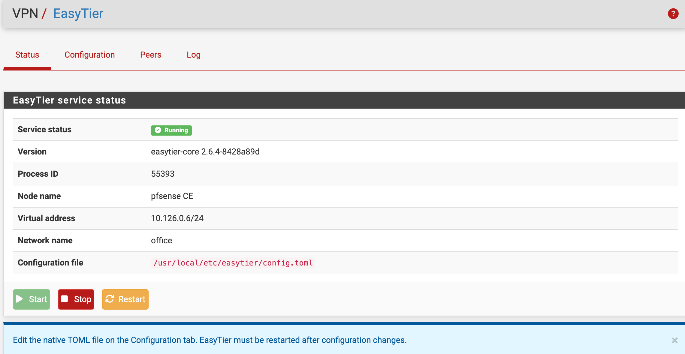
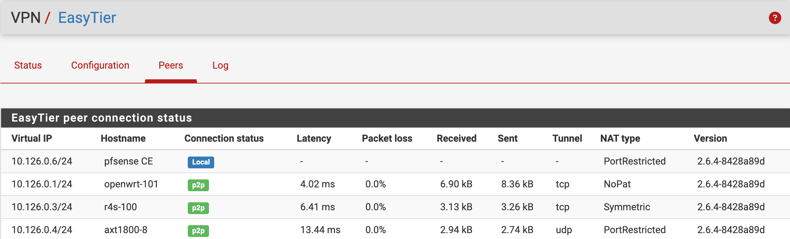

# pfSense EasyTier 插件

`pfSense-pkg-easytier` 是适用于 pfSense 的 EasyTier 组网 VPN 插件。它集成 EasyTier Core、命令行工具、启动服务和 pfSense WebGUI，可在 **VPN > EasyTier** 中完成配置、服务管理、状态查看、节点查看和日志排查。

当前插件版本：`1.0.4`

内置 EasyTier 版本：`2.6.4`



## 支持平台

| pfSense | FreeBSD ABI | 架构 | 状态 |
| --- | --- | --- | --- |
| pfSense CE 2.8.1 | `FreeBSD:15:amd64` | amd64 | 支持 |
| pfSense CE 2.9.0 | `FreeBSD:16:amd64` | amd64 | 已测试 |
| pfSense Plus 26.03 / 26.07 | `FreeBSD:16:amd64` | amd64 | 兼容 / 已测试 |

安装脚本会拒绝 FreeBSD 15、16 以外的 ABI。

## 主要功能

- 在 pfSense WebGUI 中启动、停止和重启 EasyTier
- 直接编辑原生 EasyTier TOML 配置
- 显示服务、版本、进程、节点、虚拟地址和网络状态
- 显示节点延迟、丢包率、流量、隧道和 NAT 类型
- 查看最近 100 行日志，并自动隐藏网络密钥
- 使用 gettext 提供英文和简体中文界面
- 为动态 `easytier0` 接口加载 IPv4 `any to any` 状态规则
- 安装或升级时清理遗留的 EasyTier 固定接口分配，防止重启后 WAN、LAN 接口错乱
- 卸载时清理 VPN 菜单、服务和软件包元数据
- 首次安装时生成默认配置，升级和强制重装不会覆盖已有配置

## 目录结构

```text
packaging/freebsd/                         FreeBSD pkg 元数据和安装/卸载脚本
src/etc/rc.conf.d/easytier                 rc.conf 默认配置
src/usr/local/etc/rc.d/easytier            服务启动脚本
src/usr/local/pkg/easytier.inc              pfSense 集成、动态规则和接口清理
src/usr/local/pkg/easytier.xml              菜单、服务与软件包元数据
src/usr/local/sbin/easytier-core            EasyTier 核心程序
src/usr/local/sbin/easytier-cli             EasyTier 命令行工具
src/usr/local/www/vpn_easytier.php          WebGUI 页面
src/usr/local/share/pfSense-pkg-easytier/   默认配置和包信息
src/usr/local/share/locale/                  gettext 翻译文件
translations/                               POT/PO 翻译源文件
```

## 安装

### 通过 Opnwall 社区仓库安装

pfSense CE：

```sh
fetch -o /usr/local/etc/pkg/repos/opnwall.conf https://opnwall.github.io/pfSense-repo/pfsense-ce-opnwall.conf
pkg update -f
pkg install pfSense-pkg-easytier
```

pfSense Plus：

```sh
fetch -o /usr/local/etc/pkg/repos/opnwall.conf https://opnwall.github.io/pfSense-repo/pfsense-plus-opnwall.conf
pkg update -f
pkg install pfSense-pkg-easytier
```

如需在 pfSense 软件包管理器中显示社区插件，可以执行：

```sh
fetch -qo - https://opnwall.github.io/pfSense-repo/enable-opnwall-gui.sh | sh
```

### 离线安装

根据主机 FreeBSD 版本下载对应软件包，然后执行：

```sh
pkg add -f pfSense-pkg-easytier-freebsd15.pkg
# 或
pkg add -f pfSense-pkg-easytier-freebsd16.pkg
```

安装完成后刷新 WebGUI，进入 **VPN > EasyTier**。

## 配置和使用

首次安装时，示例文件会以 `0600` 权限复制到：

```text
/usr/local/etc/easytier/config.toml
```

进入 **VPN > EasyTier > 配置**，按实际网络修改 TOML。至少需要设置节点名称、虚拟地址、初始连接节点、网络名称、网络密钥和需要发布的本地网段。

```toml
instance_name = "pfsense"
hostname = "pfsense"
ipv4 = "10.126.0.5/24"
dhcp = false

listeners = [
    "tcp://0.0.0.0:11010",
    "udp://0.0.0.0:11010",
]

rpc_portal = "127.0.0.1:15888"

[[peer]]
uri = "tcp://服务器地址:11010"

[[proxy_network]]
cidr = "192.168.10.0/24"

[network_identity]
network_name = "office"
network_secret = "请替换为自己的网络密钥"

[flags]
dev_name = "easytier0"
default_protocol = "tcp"
enable_encryption = true
enable_ipv6 = false
mtu = 1300
private_mode = true
proxy_forward_by_system = true
```

点击 **保存并重启** 后，到状态、节点和日志页面确认运行结果。

[查看默认 TOML 配置](src/usr/local/share/pfSense-pkg-easytier/config.toml.sample)



## 动态接口与防火墙规则

EasyTier 使用运行时创建的 `easytier0` TUN 接口。插件通过 pfSense 过滤器钩子，在接口存在时动态加载以下等效规则：

```text
pass in quick on easytier0 inet from any to any flags S/SA keep state
```

该规则便于不同 EasyTier 地址和代理网段直接工作。正式环境可根据实际安全要求进一步限制来源、目标和端口。

**不要在“接口 > 分配”中手工添加 `easytier0`。** 动态接口启动顺序可能影响 pfSense 接口识别，造成重启后需要重新分配 WAN 和 LAN。插件会清理历史遗留的 EasyTier 固定接口及关联规则。

## 配置与日志保留

以下文件在升级和卸载时保留：

```text
/usr/local/etc/easytier/config.toml
/var/log/easytier.log
```

首次安装只在配置文件不存在时复制默认配置，绝不会覆盖已有文件。

## 卸载

```sh
pkg delete pfSense-pkg-easytier
```

卸载脚本会停止服务并清理 VPN 菜单、服务和软件包注册信息，但保留配置文件及日志，便于以后恢复。

## 编译

必须在 FreeBSD 或 pfSense 主机上编译，并确保已安装 `pkg`：

```sh
make package ABI=native
```

也可以明确指定 ABI 和输出文件名：

```sh
TARGET_ABI=FreeBSD:15:amd64 OUTPUT_NAME=pfSense-pkg-easytier-freebsd15.pkg sh build.sh
TARGET_ABI=FreeBSD:16:amd64 OUTPUT_NAME=pfSense-pkg-easytier-freebsd16.pkg sh build.sh
```

构建结果位于 `dist/`。建议分别在对应的 FreeBSD 15、16 pfSense 主机上安装验证。

## 注意事项

- 不要把 `easytier0` 分配为 pfSense 固定接口。
- 不要使用 Shellcmd 重复添加 EasyTier 开机启动命令。
- 两端发布的局域网网段不能相互重叠。
- 如果只能访问远端路由器而无法访问其后方客户端，请检查代理网段、系统转发、客户端默认网关和主机防火墙。
- 本项目为非官方社区插件，不受 Netgate 或 pfSense 官方支持，使用者应自行评估风险。

## 相关项目

- [EasyTier](https://github.com/EasyTier/EasyTier)
