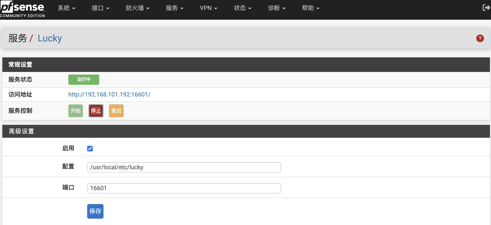

# Lucky for pfSense


Lucky 是一款面向家庭网络和路由器场景的一体化管理工具，提供动态域名解析（DDNS）、ACME 证书管理、端口转发、Web 服务、计划任务等丰富功能。
本项目将 **Lucky** 集成到 pfSense WebUI 中，为用户提供便捷的图形化管理界面。

已在以下环境测试通过：

- pfSense CE 2.8.1
- pfSense Plus 26.03.1



## 编译

请在 FreeBSD 或 pfSense 环境中编译：

```sh
ABI=native ./build.sh
```

默认会优先使用源码目录中的本地文件：

```text
src/usr/local/bin/lucky_2.27.2_freebsd_x86_64.tar.gz
```

如果本地文件不存在，构建脚本会从 Lucky 上游 GitHub Release 下载对应版本。可以通过以下变量覆盖默认值：

```sh
LUCKY_VERSION=2.27.2 ./build.sh
LUCKY_ASSET=lucky_2.27.2_freebsd_x86_64.tar.gz ./build.sh
LUCKY_DOWNLOAD_URL=https://example.com/lucky.tar.gz ./build.sh
```

编译完成后的软件包位于：

```text
dist/pfSense-pkg-lucky.pkg
```

## 安装

```sh
pkg add -f dist/pfSense-pkg-lucky.pkg
```

安装完成后刷新 pfSense WebGUI，打开：

```text
服务 > Lucky
```

Lucky 默认访问地址为：

```text
http://<pfSense-IP>:16601/
```

## 卸载

```sh
pkg delete -y pfSense-pkg-lucky
```

卸载时会停止 Lucky 服务，并清理软件包注册信息。

## 免责

这是一个非官方社区项目，不受 pfSense 团队支持，自行承担使用过程中可能产生的风险。
