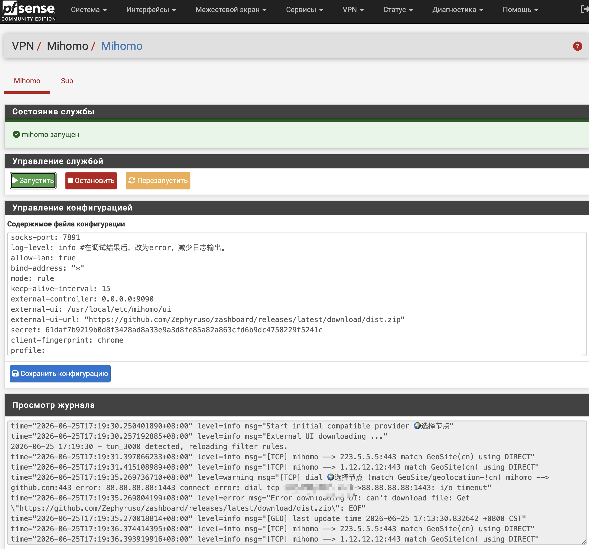

<div align="center">
  <a href="README.md">中文</a>  |
  <a href="README.US.md">English</a> |
  <a href="README.RU.md">Русский</a>
</div>

# Mihomo for pfSense


Mihomo, ранее известный как Clash Meta, это высокопроизводительное открытое прокси-ядро, совместимое с конфигурациями Clash. Оно расширяет Clash дополнительными протоколами и функциями, включая гибкую маршрутизацию по правилам, DNS, балансировку нагрузки и прозрачное проксирование.

Этот проект упаковывает Mihomo как плагин pfSense, чтобы запускать Mihomo на pfSense и управлять прозрачным прокси через WebGUI pfSense.

Проверено на:

- pfSense CE 2.8.1
- pfSense Plus 26.03



## Бинарный файл

Проект использует статический бинарный файл от [Vincent-Loeng](https://github.com/Vincent-Loeng/clash-meta). Стандартный путь к локальному файлу:

```text
bin/clash-meta-freebsd-amd64.xz
```

Скрипт сборки сначала использует локальный файл `bin/clash-meta-freebsd-amd64.xz`. Если файл отсутствует, он скачивает его с GitHub:

```text
https://github.com/Vincent-Loeng/clash-meta/releases/latest/download/clash-meta-freebsd-amd64.xz
```

## Примечания

1. В настоящее время поддерживаются только платформы x86_64 / amd64.
2. Нет необходимости добавлять сетевые интерфейсы или правила брандмауэра; для начала работы достаточно просто обновить информацию об узле (node).
3. После установки и настройки рекомендуется установить уровень логирования (log level) на `error`, чтобы избежать избыточного накопления логов при длительной работе.
4. В конфигурации по умолчанию включен API Clash; вы можете получить доступ к панели управления по адресу `http://LAN_IP:9090/ui` для просмотра сведений о прокси-соединениях.
5. Не изменяйте имя TUN-интерфейса (`tun_mihomo`) в файле `config.yaml`, так как это нарушит работу правил брандмауэра, создаваемых установщиком по умолчанию.

## Опции оптимизации
Для повышения эффективности разрешения DNS-имен можно добавить следующие параметры в настройки DNS-резолвера (Unbound); это позволит перенаправлять стандартные запросы на разрешение имен в mihomo:
```text
server:
    do-not-query-localhost: no
    prefetch: yes
    serve-expired: yes
    serve-expired-ttl: 300
forward-zone:
    name: "."
    forward-addr: 127.0.0.1@1053
```

## Установка

Загрузите пакет на pfSense и выполните:

```sh
pkg add -f pfSense-pkg-mihomo.pkg
```

После установки обновите WebGUI pfSense и перейдите в:

```text
VPN > Mihomo
```

## Удаление

```sh
pkg delete pfSense-pkg-mihomo
```

## Обновление подписки

Автоматическое обновление подписки можно настроить через Cron:

```text
Services > Cron
```

Добавьте задачу с командой:

```sh
/usr/bin/sub
```

## Сборка pkg

Выполните сборку на хосте под управлением FreeBSD или pfSense. Потребуются следующие команды:

```sh
pkg, tar, make, xz, curl или fetch
```

Сборка universal amd64 пакета по умолчанию:

```sh
make package ABI=universal
```

Выходной файл:

```text
dist/pfSense-pkg-mihomo_1.0.pkg
```

Проверить метаданные пакета:

```sh
pkg info -F dist/pfSense-pkg-mihomo_1.0.pkg
```

## Полезные команды

Управление службой:

```sh
service mihomo start
service mihomo stop
service mihomo status
service mihomo restart
service mihomo rcvar
```

Просмотр журнала:

```sh
tail -f /var/log/mihomo.log
```

Проверка слушающих портов:

```sh
sockstat -4 -l | egrep ':53|:7891|:9090'
```

Проверка TUN-интерфейса:

```sh
ifconfig tun_mihomo
```

Проверка runtime-правил firewall:

```sh
pfctl -sr | grep -E 'tun_mihomo'
```

## Благодарности

[MetaCubeX](https://github.com/MetaCubeX/mihomo)<br>
[Vincent-Loeng](https://github.com/Vincent-Loeng?tab=repositories)

## Отказ от ответственности

> [!CAUTION]
> Это неофициальный плагин, который не поддерживается Netgate или командой pfSense. Используйте на свой риск.
