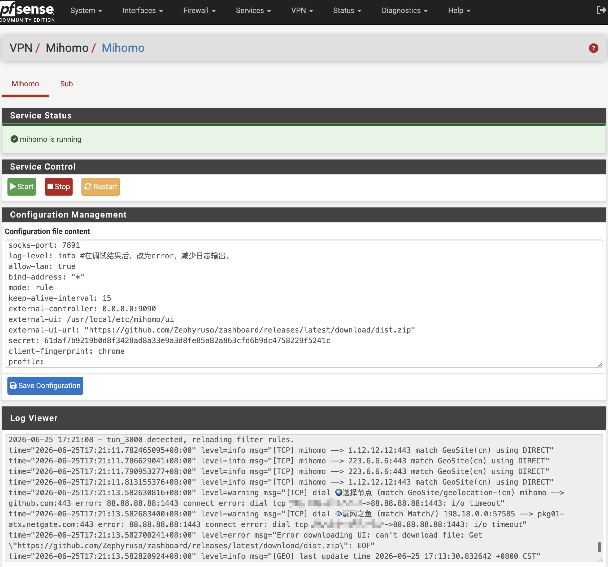

<div align="center">
  <a href="README.md">中文</a>  |
  <a href="README.US.md">English</a> |
  <a href="README.RU.md">Русский</a>
</div>

# Mihomo for pfSense


Mihomo, formerly Clash Meta, is a high-performance open source proxy core compatible with Clash configuration files. It extends Clash with additional protocols and advanced features, including flexible rule-based routing, DNS handling, load balancing, and transparent proxy support.

This project packages Mihomo as a pfSense plugin so it can run on pfSense and provide transparent proxy functionality through the pfSense WebGUI.

Tested on:

- pfSense CE 2.8.1
- pfSense Plus 26.03



## Binary

The project uses the static binary from [Vincent-Loeng](https://github.com/Vincent-Loeng/clash-meta). The default local asset path is:

```text
bin/clash-meta-freebsd-amd64.xz
```

The build script prefers the local `bin/clash-meta-freebsd-amd64.xz` file. If it is missing, the script downloads it from GitHub:

```text
https://github.com/Vincent-Loeng/clash-meta/releases/latest/download/clash-meta-freebsd-amd64.xz
```

## Notes

1. Currently, only x86_64 / amd64 platforms are supported.
2. No need to add interfaces or firewall rules; simply update the node information to get started.
3. After installation and setup, set the log level to `error` to prevent excessive log generation during long-term operation.
4. The default configuration enables the Clash API; you can access the dashboard at `http://LAN_IP:9090/ui` to view proxy connection details.
5. Do not modify the TUN interface name (`tun_mihomo`) in `config.yaml`, as doing so will interfere with the default firewall rules generated by the installer.

## Optimization Options
To improve DNS resolution efficiency, you can add the following content to the custom options for DNS resolution (Unbound) to forward default resolution requests to mihomo:
```text
server:
    do-not-query-localhost: no
    prefetch: yes
    serve-expired: yes
    serve-expired-ttl: 300
forward-zone:
    name: "."
    forward-addr: 127.0.0.1@1053
```

## Install

Upload the package to pfSense and run:

```sh
pkg add -f pfSense-pkg-mihomo.pkg
```

After installation, refresh the pfSense WebGUI and go to:

```text
VPN > Mihomo
```

## Uninstall

```sh
pkg delete pfSense-pkg-mihomo
```

## Subscription Updates

Automatic subscription updates can be scheduled with Cron:

```text
Services > Cron
```

Add a scheduled task with this command:

```sh
/usr/bin/sub
```

## Build pkg

Build on a FreeBSD or pfSense host. The following commands are required:

```sh
pkg, tar, make, xz, curl or fetch
```

Build a universal amd64 package by default:

```sh
make package ABI=universal
```

Output file:

```text
dist/pfSense-pkg-mihomo_1.0.pkg
```

Inspect package metadata:

```sh
pkg info -F dist/pfSense-pkg-mihomo_1.0.pkg
```

## Common Commands

Service control:

```sh
service mihomo start
service mihomo stop
service mihomo status
service mihomo restart
service mihomo rcvar
```

View logs:

```sh
tail -f /var/log/mihomo.log
```

Check listening ports:

```sh
sockstat -4 -l | egrep ':53|:7891|:9090'
```

Check the TUN interface:

```sh
ifconfig tun_mihomo
```

Check runtime firewall rules:

```sh
pfctl -sr | grep -E 'tun_mihomo'
```

## Credits

[MetaCubeX](https://github.com/MetaCubeX/mihomo)<br>
[Vincent-Loeng](https://github.com/Vincent-Loeng?tab=repositories)

## Disclaimer

> [!CAUTION]
> This is an unofficial plugin and is not supported by Netgate or the pfSense team. Use it at your own risk.
