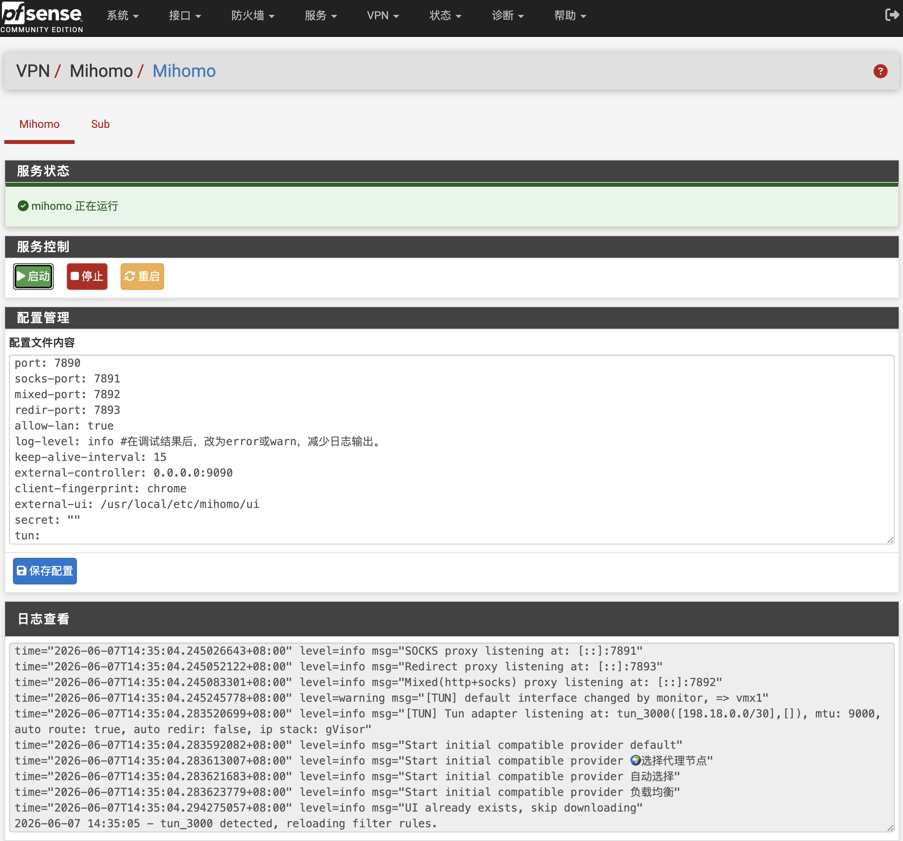

<div align="center">
  <a href="README.md">中文</a>  |
  <a href="README.US.md">English</a> |
  <a href="README.RU.md">Русский</a>
</div>

# Mihomo for pfSense


Mihomo（原 Clash Meta）是一款高性能、功能丰富的开源代理核心，兼容 Clash 配置格式，并在此基础上扩展了更多协议和高级功能，支持多种代理协议，提供灵活的规则分流、DNS 管理、负载均衡和透明代理功能。凭借其优秀的性能和广泛的兼容性，Mihomo 已成为构建现代网络代理和流量管理解决方案的重要工具之一。

本项目是一个用于 pfSense 的 Mihomo 插件，用于在 pfSense 上运行 Mihomo 并实现透明代理功能。

已在以下环境测试通过：

- pfSense CE 2.8.1
- pfSense Plus 26.03



## 项目程序

项目使用 [Vincent-Loeng](https://github.com/Vincent-Loeng/clash-meta) 静态二进制文件。

## 注意事项

1. 当前仅支持 x86_64 / amd64 平台。
2. 无需添加接口、防火墙规则，只需修改节点信息即可使用。
3. 安装调试完成后，将日志层级调整为 `error`，避免长期运行产生过多日志。
4. 默认配置会开启 Clash API，可通过 `http://LAN_IP:9090/ui` 访问仪表盘查看代理连接信息。
5. 修改配置不要改动config.yaml文件tun接口名称（tun_mihomo），否则会影响安装程序生成的默认防火墙规则。

## 优化选项
为了提升 DNS 的解析效率，可以在DNS解析（Unbound）的自定义选项中，添加以下内容，将默认解析转发到 mihomo 来完成。
```text
server:
    do-not-query-localhost: no
    prefetch: yes
    serve-expired: yes
    serve-expired-ttl: 300
forward-zone:
    name: "."
    forward-addr: 127.0.0.1@1053
```

## 安装命令

将安装包上传到 pfSense 后执行：
```sh
pkg add -f pfSense-pkg-mihomo.pkg
```
安装完成后刷新 pfSense WebGUI，进入：
```text
VPN > Mihomo
```
## 卸载命令
```sh
pkg delete pfSense-pkg-mihomo
```
## 订阅更新
自动更新订阅可通过 Cron 完成：
```text
转到 服务 > Cron
```
添加定时任务，命令填写：
```sh
/usr/bin/sub
```
## 编译 pkg
在 FreeBSD 或 pfSense 主机上构建。需要以下命令：
```sh
pkg、tar、make、xz、curl 或 fetch
```
二进制压缩文件路径如下：
```text
src/usr/local/bin/clash-meta-freebsd-amd64.xz
```
构建脚本会优先使用本地 文件。如果本地文件不存在，会从 Github 下载：
```text
https://github.com/Vincent-Loeng/clash-meta/releases/latest/download/clash-meta-freebsd-amd64.xz
```

默认构建 universal amd64 包：

```sh
make package ABI=universal
```
生成文件：

```text
dist/pfSense-pkg-mihomo_1.0.pkg
```
检查安装包元数据：
```sh
pkg info -F dist/pfSense-pkg-mihomo_1.0.pkg
```
## 常用命令
服务控制：
```sh
service mihomo start
service mihomo stop
service mihomo status
service mihomo restart
service mihomo rcvar
```
查看日志：
```sh
tail -f /var/log/mihomo.log
```
检查监听端口：
```sh
sockstat -4 -l | egrep ':53|:7891|:9090'
```
检查 TUN 接口：
```sh
ifconfig tun_mihomo
```
检查防火墙运行规则：
```sh
pfctl -sr | grep -E 'tun_mihomo'
```
## 致谢
[MetaCubeX](https://github.com/MetaCubeX/mihomo)<br>
[Vincent-Loeng](https://github.com/Vincent-Loeng?tab=repositories)

## 免责声明

这是一个非官方社区项目，不受 pfSense 团队支持，自行承担使用过程中可能产生的风险。
