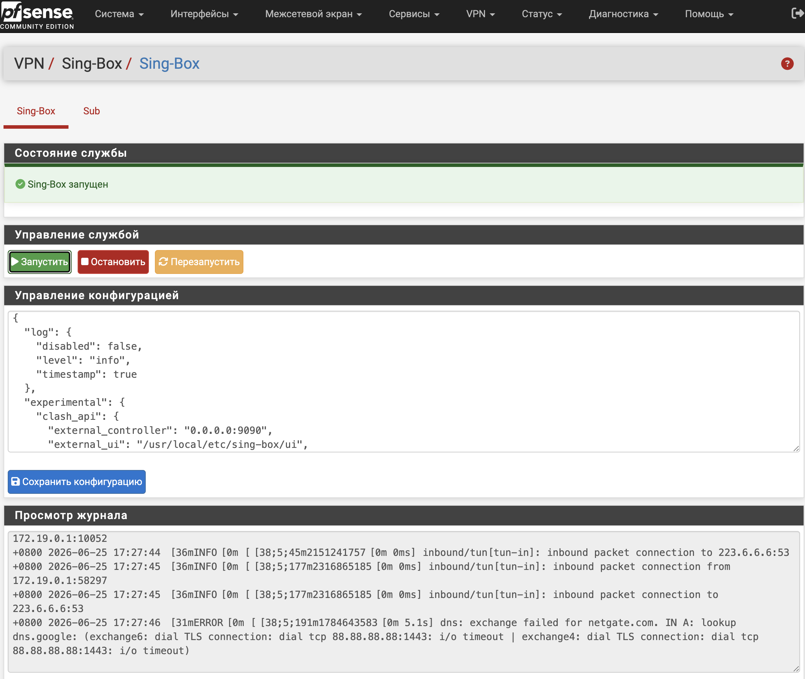

<div align="center">
  <a href="README.md">中文</a>  |
  <a href="README.US.md">English</a> |
  <a href="README.RU.md">Русский</a>
</div>

# Sing-Box for pfSense


sing-box это мощная и производительная открытая прокси-платформа с поддержкой многих популярных прокси-протоколов. Современная архитектура обеспечивает высокую производительность, низкое потребление ресурсов и гибкую настройку для проксирования, маршрутизации трафика, балансировки нагрузки и безопасного доступа.

Этот проект интегрирует sing-box в WebGUI pfSense и добавляет прозрачное проксирование, редактирование конфигурации, управление службой, мониторинг состояния и просмотр журналов.

Проверено на:

- pfSense CE 2.8.1
- pfSense Plus 26.03



## Бинарный файл

Проект использует статический бинарный файл от [Vincent-Loeng](https://github.com/Vincent-Loeng/bsd-box). Стандартный путь к локальному файлу:

```text
bin/bsd-box-reF1nd-freebsd-amd64.xz
```

Скрипт сборки сначала использует локальный файл `bin/bsd-box-reF1nd-freebsd-amd64.xz`. Если файл отсутствует, он скачивает его с GitHub:

```text
https://github.com/Vincent-Loeng/bsd-box/releases/latest/download/bsd-box-reF1nd-freebsd-amd64.xz
```

## Примечания

1. В настоящее время поддерживаются только платформы x86_64 / amd64.
2. Нет необходимости добавлять сетевые интерфейсы или правила брандмауэра; для начала работы достаточно изменить соответствующие параметры узла (node) в конфигурации по умолчанию.
3. После установки и настройки рекомендуется установить уровень логирования `error`, чтобы избежать избыточного накопления логов при длительной работе.
4. Установщик добавляет в DNS-резолвер специальные параметры для реализации маршрутизации Split DNS (разделение внутреннего и зарубежного трафика) с помощью sing-box.
5. Форматы конфигурации могут различаться в разных версиях sing-box; конфигурация по умолчанию, входящая в состав релиза, гарантированно совместима только с текущей версией установочного пакета.
6. В конфигурации по умолчанию включен API Clash; вы можете получить доступ к панели управления по адресу `http://LAN_IP:9090/ui` для просмотра информации о прокси-соединениях.
7. При редактировании конфигурации не меняйте имя TUN-интерфейса (`tun_singbox`) в файле `config.json`, так как это повлияет на правила брандмауэра, создаваемые установщиком по умолчанию.

## Установка

Загрузите пакет на pfSense и выполните:

```sh
pkg add pfSense-pkg-sing-box.pkg
```

После установки обновите WebGUI pfSense и перейдите в:

```text
VPN > Sing-Box
```

## Удаление

```sh
pkg remove pfSense-pkg-sing-box
```

## Обновление подписки

Автоматическое обновление подписки можно настроить через Cron:

```text
Services > Cron
```

Добавьте задачу с командой:

```sh
/usr/bin/sub
```

## Сборка pkg

Сборка выполняется на хосте FreeBSD. Необходимые команды:

```sh
pkg, tar, make, xz, curl или fetch
```

Сборка universal amd64 пакета по умолчанию:

```sh
make package ABI=universal
```

Выходной файл:

```text
dist/pfSense-pkg-sing-box_1.0.pkg
```

Очистить каталог сборки:

```sh
make clean
```

Проверить метаданные пакета:

```sh
pkg info -F dist/pfSense-pkg-sing-box_1.0.pkg
```

## Полезные команды

Управление службой:

```sh
service sing-box start
service sing-box stop
service sing-box status
service sing-box restart
service sing-box rcvar
```

Проверка конфигурации:

```sh
sing-box check -c /usr/local/etc/sing-box/config.json
```

Просмотр журнала:

```sh
tail -f /var/log/sing-box.log
```

Проверка слушающих портов:

```sh
sockstat -4 -l | egrep ':53|:7891|:9090'
```

Проверка TUN-интерфейса:

```sh
ifconfig tun_singbox
```

Проверка runtime-правил firewall:

```sh
pfctl -sr | grep -E 'tun_singbox'
```

## Благодарности

[SagerNet](https://github.com/SagerNet/sing-box)<br>
[Vincent-Loeng](https://github.com/Vincent-Loeng?tab=repositories)

## Отказ от ответственности

> [!CAUTION]
> Это неофициальный плагин, который не поддерживается Netgate или командой pfSense. Используйте на свой риск.
