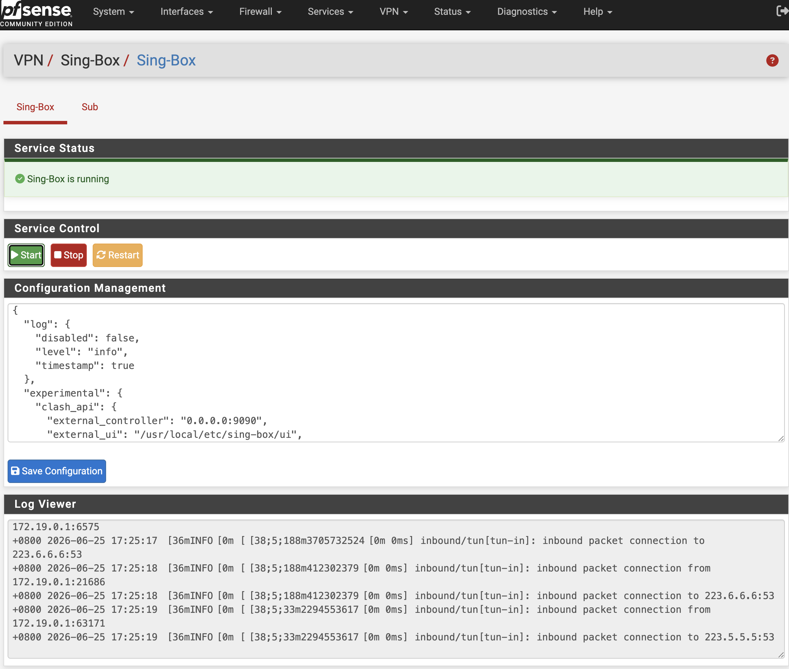

<div align="center">
  <a href="README.md">中文</a>  |
  <a href="README.US.md">English</a> |
  <a href="README.RU.md">Русский</a>
</div>

# Sing-Box for pfSense


sing-box is a powerful, high-performance open source proxy platform that supports many mainstream proxy protocols. Its modern architecture provides high performance, low resource usage, and flexible configuration for proxying, traffic routing, load balancing, and secure access scenarios.

This project integrates sing-box into the pfSense WebGUI with transparent proxy support, configuration editing, service management, status monitoring, and log viewing.

Tested on:

- pfSense CE 2.8.1
- pfSense Plus 26.03



## Binary

The project uses the static binary from [Vincent-Loeng](https://github.com/Vincent-Loeng/bsd-box). The default local asset path is:

```text
bin/bsd-box-reF1nd-freebsd-amd64.xz
```

The build script prefers the local `bin/bsd-box-reF1nd-freebsd-amd64.xz` file. If it is missing, the script downloads it from GitHub:

```text
https://github.com/Vincent-Loeng/bsd-box/releases/latest/download/bsd-box-reF1nd-freebsd-amd64.xz
```

## Notes

1. Currently, only x86_64 / amd64 platforms are supported.
2. No need to add network interfaces or firewall rules; simply modify the relevant node information in the default configuration to get started.
3. After installation and setup, adjust the log level to `error` to prevent excessive log generation during long-term operation.
4. The installer adds custom options to the DNS resolver to enable split DNS routing (separating domestic and international traffic) via sing-box.
5. Configuration formats vary between sing-box versions; the default configuration included in the release is guaranteed to be compatible only with the current installation package version.
6. The default configuration enables the Clash API; you can access the dashboard at `http://LAN_IP:9090/ui` to view proxy connection details.
7. When modifying the configuration, do not change the TUN interface name (`tun_singbox`) in `config.json`, as doing so will affect the default firewall rules generated by the installer.

## Install

Upload the package to pfSense and run:

```sh
pkg add pfSense-pkg-sing-box.pkg
```

After installation, refresh the pfSense WebGUI and go to:

```text
VPN > Sing-Box
```

## Uninstall

```sh
pkg remove pfSense-pkg-sing-box
```

## Subscription Updates

Automatic subscription updates can be scheduled with Cron:

```text
Services > Cron
```

Add a scheduled task with this command:

```sh
/usr/bin/sub
```

## Build pkg

Build on a FreeBSD host. Required commands:

```sh
pkg, tar, make, xz, curl or fetch
```

Build a universal amd64 package by default:

```sh
make package ABI=universal
```

Output file:

```text
dist/pfSense-pkg-sing-box_1.0.pkg
```

Clean the build directory:

```sh
make clean
```

Inspect package metadata:

```sh
pkg info -F dist/pfSense-pkg-sing-box_1.0.pkg
```

## Common Commands

Service control:

```sh
service sing-box start
service sing-box stop
service sing-box status
service sing-box restart
service sing-box rcvar
```

Configuration validation:

```sh
sing-box check -c /usr/local/etc/sing-box/config.json
```

View logs:

```sh
tail -f /var/log/sing-box.log
```

Check listening ports:

```sh
sockstat -4 -l | egrep ':53|:7891|:9090'
```

Check the TUN interface:

```sh
ifconfig tun_singbox
```

Check runtime firewall rules:

```sh
pfctl -sr | grep -E 'tun_singbox'
```

## Credits

[SagerNet](https://github.com/SagerNet/sing-box)<br>
[Vincent-Loeng](https://github.com/Vincent-Loeng?tab=repositories)

## Disclaimer

> [!CAUTION]
> This is an unofficial plugin and is not supported by Netgate or the pfSense team. Use it at your own risk.
