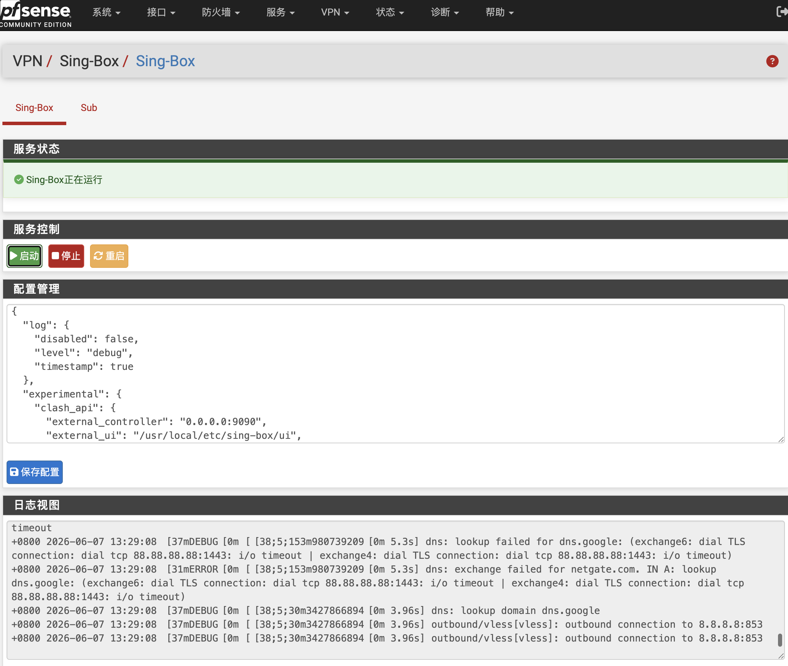

<div align="center">
  <a href="README.md">中文</a>  |
  <a href="README.US.md">English</a> |
  <a href="README.RU.md">Русский</a>
</div>

# Sing-Box for pfSense


sing-box 是一款功能强大、性能优秀的开源网络代理平台，支持多种主流代理协议。它基于现代化架构设计，具备高性能、低资源占用和灵活配置等特点，可用于网络代理、流量分流、负载均衡以及安全访问等场景。

本项目将 sing-box 无缝集成到 pfSense WebUI，支持透明代理，并提供配置编辑、服务管理、状态监控和日志查看等功能，使用户能够通过图形界面轻松管理 sing-box。

已在以下环境测试通过：

- pfSense CE 2.8.1
- pfSense Plus 26.03



## 项目程序

项目使用 [Vincent-Loeng](https://github.com/Vincent-Loeng/bsd-box) 静态二进制程序。

## 注意事项

1. 当前仅支持 x86_64 / amd64 平台。
2. 无需添加接口、防火墙规则。只需修改默认配置节点部分信息即可使用。
3. 安装调试完成后，将日志层级调整为 `error`，避免长期运行产生过多日志。
4. 安装程序会在 DNS 解析器添加自定义选项，以便通过sing-box实现国内外 DNS 解析分流。
5. sing-box 不同版本之间配置格式存在差异，Release 中的默认配置仅保证匹配当前安装包版本。
6. 默认配置会开启 Clash API，可通过 `http://LAN_IP:9090/ui` 访问仪表盘查看代理连接信息。
7. 修改配置不要改动config.json文件tun接口名称（tun_singbox），否则会影响安装程序生成的默认防火墙规则。

## 安装命令
将安装包上传到 pfSense 后执行：
```sh
pkg add pfSense-pkg-sing-box.pkg
```
安装完成后刷新 pfSense WebGUI，进入：
```text
VPN > Sing-Box
```
## 卸载命令
```sh
pkg remove pfSense-pkg-sing-box
```
## 订阅更新
自动更新订阅可通过 Cron 完成：
```text
转到 服务 > Cron
```
添加定时任务，命令填写：
```sh
/usr/bin/sub
```
## 编译 pkg
在 FreeBSD 或 pfSense 主机上构建。需要以下命令：
```sh
pkg、tar、make、xz、curl 或 fetch
```
二进制压缩文件路径如下：
```text
src/usr/local/bin/bsd-box-reF1nd-freebsd-amd64.xz
```
构建脚本会优先使用本地文件。如果本地文件不存在，会从 Github 下载：
```text
https://github.com/Vincent-Loeng/bsd-box/releases/latest/download/bsd-box-reF1nd-freebsd-amd64.xz
```
默认构建 universal amd64 包：
```sh
make package ABI=universal
```
生成文件：
```text
dist/pfSense-pkg-sing-box_1.0.pkg
```
清理构建目录：

```sh
make clean
```
检查安装包元数据：
```sh
pkg info -F dist/pfSense-pkg-sing-box_1.0.pkg
```
## 常用命令
服务控制：
```sh
service sing-box start
service sing-box stop
service sing-box status
service sing-box restart
service sing-box rcvar
```
配置校验：
```sh
sing-box check -c /usr/local/etc/sing-box/config.json
```
查看日志：
```sh
tail -f /var/log/sing-box.log
```
检查监听端口：
```sh
sockstat -4 -l | egrep ':53|:7891|:9090'
```
检查 TUN 接口：
```sh
ifconfig tun_singbox
```
检查防火墙运行时规则：
```sh
pfctl -sr | grep -E 'tun_singbox'
```
## 致谢
[SagerNet](https://github.com/SagerNet/sing-box)<br>
[Vincent-Loeng](https://github.com/Vincent-Loeng?tab=repositories)

## 免责声明

这是一个非官方社区项目，不受 pfSense 团队支持，自行承担使用过程中可能产生的风险。
