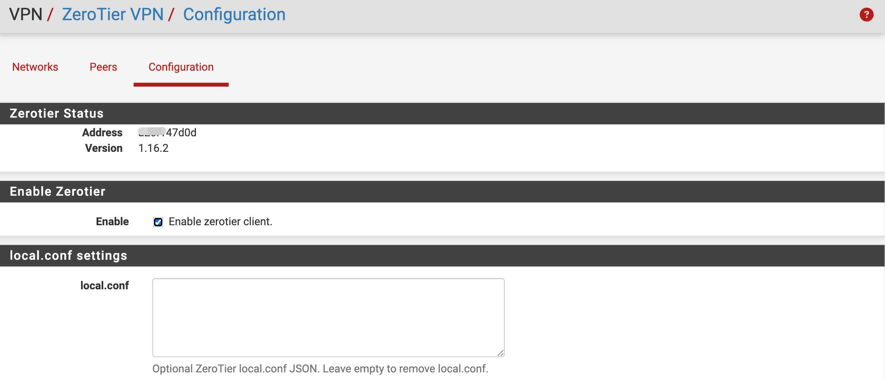
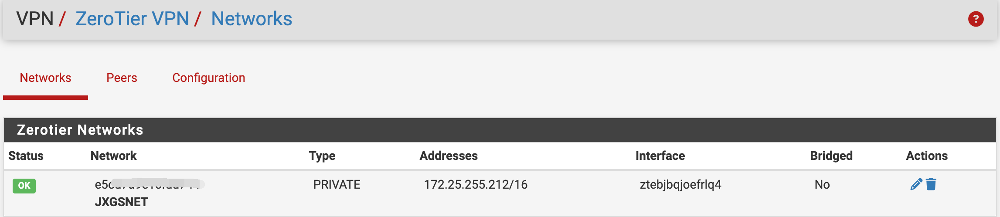
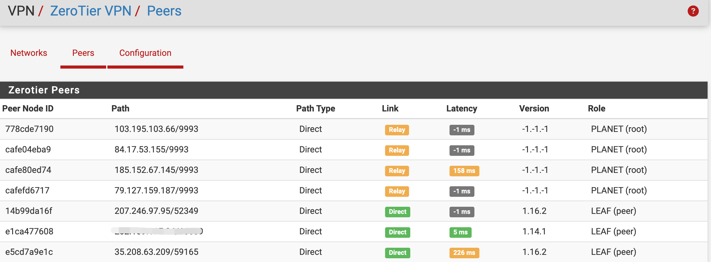

# pfSense ZeroTier 插件

`pfSense-pkg-zerotier` 是适用于 pfSense 的 ZeroTier 组网 VPN 插件。它集成 ZeroTier 程序、启动服务和 pfSense WebGUI，可在 **VPN > ZeroTier VPN** 中启停服务、加入或退出网络、查看网络与节点状态，并自动管理动态接口的防火墙规则。

当前插件版本：`1.16.2_3`

内置 ZeroTier 版本：`1.16.2`



## 支持平台

| pfSense | FreeBSD ABI | 架构 | 状态 |
| --- | --- | --- | --- |
| pfSense CE 2.8.1 | `FreeBSD:15:amd64` | amd64 | 支持 |
| pfSense CE 2.9.0 | `FreeBSD:16:amd64` | amd64 | 已测试 |
| pfSense Plus 26.03 / 26.07 | `FreeBSD:16:amd64` | amd64 | 兼容 / 已测试 |

软件包同时内置 FreeBSD 15 和 FreeBSD 16 的 ZeroTier 程序，安装脚本会检测主机版本并部署对应文件。

## 主要功能

- 在 pfSense WebGUI 中启用、停止和重启 ZeroTier
- 加入、编辑和退出 ZeroTier 网络
- 显示网络状态、虚拟地址、动态接口及桥接状态
- 显示对等节点地址、版本、延迟、角色和连接路径
- 支持可选的 ZeroTier `local.conf` JSON 配置并验证格式
- 为活动的 `zt*` 动态接口加载 IPv4 `any to any` 状态规则
- 安装或升级时清理遗留的 ZeroTier 固定接口分配及关联规则
- 避免动态接口导致 pfSense 重启后 WAN、LAN 接口需要重新分配
- 卸载时清理 VPN 菜单、服务和软件包元数据，避免菜单残留
- 单一软件包支持 FreeBSD 15 和 FreeBSD 16

## 目录结构

```text
src/usr/local/www/                         WebGUI 页面
src/usr/local/pkg/                         pfSense XML、PHP 集成和翻译文件
src/usr/local/bin/                         FreeBSD 15/16 ZeroTier 原始软件包
src/usr/local/etc/rc.d/zerotier.sh         pfSense 服务包装脚本
src/usr/local/share/pfSense-pkg-zerotier/  pfSense 软件包元数据
build.sh                                   通用软件包构建脚本
```

## 安装

### 通过 Opnwall 社区仓库安装

pfSense CE：

```sh
fetch -o /usr/local/etc/pkg/repos/opnwall.conf https://opnwall.github.io/pfSense-repo/pfsense-ce-opnwall.conf
pkg update -f
pkg install pfSense-pkg-zerotier
```

pfSense Plus：

```sh
fetch -o /usr/local/etc/pkg/repos/opnwall.conf https://opnwall.github.io/pfSense-repo/pfsense-plus-opnwall.conf
pkg update -f
pkg install pfSense-pkg-zerotier
```

如需在 pfSense 软件包管理器中显示社区插件，可以执行：

```sh
fetch -qo - https://opnwall.github.io/pfSense-repo/enable-opnwall-gui.sh | sh
```

### 离线安装

将软件包上传到 pfSense，然后执行：

```sh
pkg add -f pfSense-pkg-zerotier.pkg
```

安装完成后刷新 WebGUI，进入 **VPN > ZeroTier VPN**。

## 启用服务

进入 **VPN > ZeroTier VPN > 配置（Configuration）**，勾选 **Enable Zerotier Client** 并保存。插件会同步设置开机启动状态并启动 ZeroTier 服务，状态区域会显示节点地址、版本和运行状态。

## 加入网络

1. 进入 **VPN > ZeroTier VPN > 网络（Networks）**。
2. 点击 **加入（Join）**。
3. 输入由 16 个十六进制字符组成的 ZeroTier Network ID。
4. 保存并等待网络出现在列表中。

首次加入时，节点通常处于未授权状态。登录 [ZeroTier Central](https://my.zerotier.com/)，进入对应网络的 Members 页面：

- 勾选 `Authorized`
- 设置便于识别的节点名称
- 分配或确认 ZeroTier 虚拟地址
- 保存设置

授权完成后，pfSense 网络页面中的状态应显示为 `OK`。



## 管理路由

如需让 ZeroTier 节点访问 pfSense 后方局域网，应在 ZeroTier Central 的 Managed Routes 中添加路由。例如：

```text
Destination: 192.168.10.0/24
Via: 10.147.20.2
```

- `Destination` 是 pfSense 的 LAN 网段。
- `Via` 是 pfSense 获得的 ZeroTier 虚拟地址。

其他站点也应发布各自的局域网路由。两端 LAN 网段不能重叠，并且终端的默认网关和主机防火墙必须允许相关通信。

## 查看节点

进入 **VPN > ZeroTier VPN > 节点（Peers）**，可以查看节点地址和版本、连接状态、延迟、节点角色、连接路径和远端物理地址。



## local.conf 高级配置

进入 **VPN > ZeroTier VPN > 配置（Configuration）**，可以在 `local.conf` 中填写可选的 ZeroTier JSON 配置。留空保存会删除现有文件。

```json
{
  "settings": {
    "portMappingEnabled": false,
    "allowTcpFallbackRelay": true
  }
}
```

配置必须是有效 JSON，否则页面会拒绝保存。可用参数请参考 [ZeroTier 官方配置文档](https://docs.zerotier.com/config/)。

## 动态接口与防火墙规则

ZeroTier 会在加入网络后创建名称以 `zt` 开头的动态接口。插件通过 pfSense 过滤器钩子，为当前活动的每个 `zt*` 接口加载等效的 IPv4 状态规则：

```text
pass in quick on zt* inet from any to any flags S/SA keep state
```

规则会随服务启动、停止、重启和动态接口变化重新同步。默认规则便于安装后直接验证 ZeroTier 网络和远程局域网的连通性；正式环境可以根据实际网段、方向和端口进一步收紧策略。

**不要在“接口 > 分配”中手工添加 `zt*` 接口。** 动态接口出现顺序并不固定，固定分配可能干扰 pfSense 接口识别，造成重启后 WAN、LAN 需要重新设置。

插件在安装或升级时会自动清理历史遗留的 ZeroTier 固定接口分配和引用这些接口的规则，并重新加载 pfSense 防火墙配置。

## 连通性测试

建议按以下顺序检查：

1. ping 对端的 ZeroTier 虚拟地址。
2. ping 对端路由器的 LAN 地址。
3. ping 对端局域网内的客户端。
4. 使用 `traceroute` 检查实际路径。
5. 测试 NAS、SSH、RDP 或 Web 管理服务。

如果只能访问对端路由器而不能访问其后方客户端，请检查 Managed Routes、对端 LAN 防火墙、客户端默认网关，以及两端 LAN 网段是否冲突。

## 卸载

```sh
pkg delete pfSense-pkg-zerotier
```

卸载脚本会：

- 停止 `zerotier-one` 服务和进程
- 删除 ZeroTier 程序、启动脚本和许可证文件
- 清理 `zerotier_enable` 配置
- 清理 pfSense 的 VPN 菜单、服务和软件包元数据
- 删除 ZeroTier VPN菜单

## 编译

必须在 FreeBSD 或 pfSense 主机上编译，并准备好以下两个原始软件包：

```text
src/usr/local/bin/zerotier-1.16.2-freebsd15.pkg
src/usr/local/bin/zerotier-1.16.2-freebsd16.pkg
```

构建同时支持 FreeBSD 15/16 的通用软件包：

```sh
sh build.sh
```

构建指定 ABI 的软件包：

```sh
TARGET_ABI=FreeBSD:15:amd64 OUTPUT_NAME=pfSense-pkg-zerotier-freebsd15.pkg sh build.sh
TARGET_ABI=FreeBSD:16:amd64 OUTPUT_NAME=pfSense-pkg-zerotier-freebsd16.pkg sh build.sh
```

默认输出为 `dist/pfSense-pkg-zerotier-1.16.2_3.pkg`。安装时脚本会检测 FreeBSD 主版本，并选择对应的 ZeroTier 程序。

## 注意事项

- 不要把动态 `zt*` 接口分配为 pfSense 固定接口。
- 不要通过 Shellcmd 重复添加 ZeroTier 开机启动命令；插件已经包含完整的服务管理逻辑。
- `any to any` 规则便于部署和测试，生产环境应按实际安全要求收紧。
- 本项目为非官方社区插件，不受 Netgate、pfSense 或 ZeroTier 官方支持，使用者应自行评估风险。

## 相关项目

- [ZeroTier](https://github.com/zerotier/ZeroTierOne)
- [ZeroTier 官方文档](https://docs.zerotier.com/)
